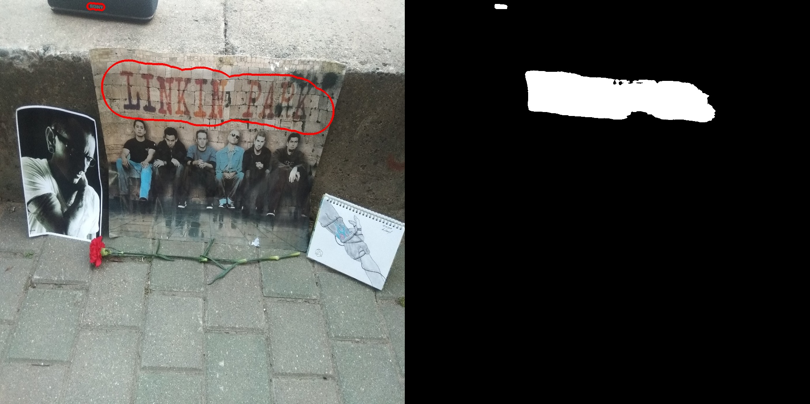

# TextSnake: A Flexible Representation for Detecting Text of Arbitrary Shapes

A PyTorch implement of **TextSnake: A Flexible Representation for Detecting Text of Arbitrary Shapes** (ECCV 2018) by `Megvii`

- Paper link: [arXiv:1807.01544](https://arxiv.org/abs/1807.01544)
- Original author's github: [princewang1994/TextSnake.pytorch](https://github.com/princewang1994/TextSnake.pytorch)

<div style="color:#0000FF" align="center">
 
</div>

## Simple inference example

```python

import cv2
import numpy as np
from inference_utils import load_image, load_detector_and_transforms, visualize_detection, predict_single_image


model_path = './weights/textsnake_my_train_v1_30.pth'
device = 'cuda'
size = 1024
tr_thresh=0.7
tcl_thresh=0.4

detector, transforms = load_detector_and_transforms(model_path, size, tr_thresh, tcl_thresh, device)

source_img = load_image('./demo/chester_minsk_20.07.2019.jpg')

transformed_img = transforms(source_img)
tcl_contours, tr_pred, tcl_pred = predict_single_image(detector, transformed_img, device)

visualize_detection(cv2.resize(source_img, (size, size)), tr_pred, tcl_pred[0], tcl_contours, tr_thresh=tr_thresh, tcl_thresh=tcl_thresh, figsize=(30,12))

```




## License

This project is licensed under the MIT License - see the [LICENSE.md](LICENSE.md) file for details

## Acknowledgement

* This project is writen by [Prince Wang](https://github.com/princewang1994), part of codes refer to [songdejia/EAST](https://github.com/songdejia/EAST)
* Thanks [techkang](https://github.com/techkang) for your great help!
